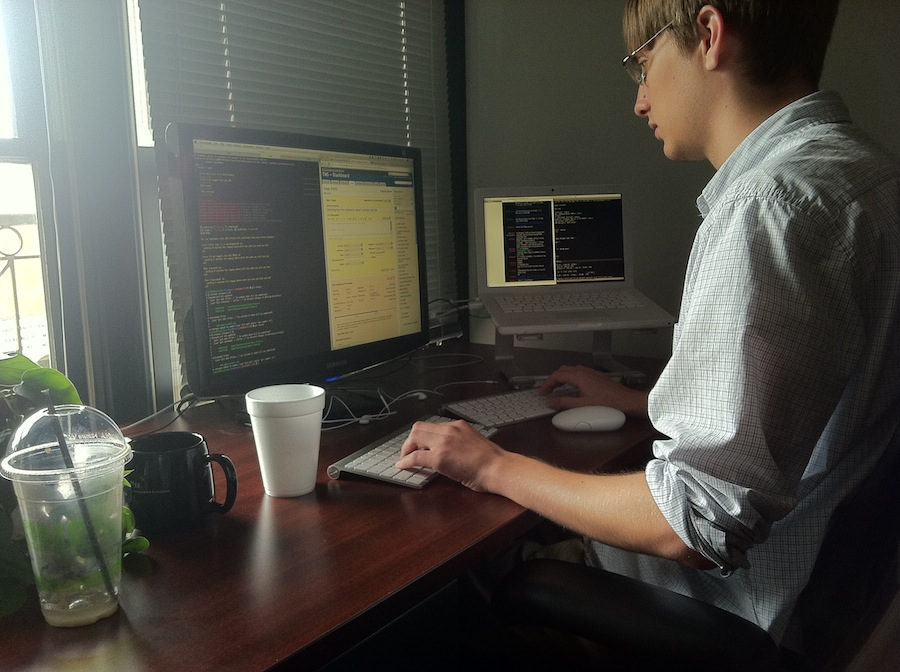

## Warning and a suggestion

This utility has a few bugs that can randomly cause it stop working under quite a few situations. Someone else has put together a new version of the tool based on the same original source. Although I haven't had a chance to try this other utlity, I recommend you do so! It's bound to be better and less buggy:

[https://github.com/mejedi/my-multiple-keyboards](https://github.com/mejedi/my-multiple-keyboards)

## DualKeyboard

DualKeyboard is a small utility to allow the use of modifier keys "across" external keyboards in OS X. This is useful for people who want to use multiple external keyboards in a split-keyboard arrangement, or because they use a foot pedal or other assistive device.

DualKeyboard is **not mine.** It was written by Chance Miller of [http://dotdotcomorg.net/](http://dotdotcomorg.net/). I have preserved it on GitHub in case his site disappears from the Internet.

## Features

- Cross-keyboard modifier keys (Control, Shift, Command, Option)
- Vim-style navigation mode using CapsLock as modifier key
  - Tap CapsLock for Escape
  - Hold CapsLock and use h,j,k,l for arrow keys
  - Additional navigation keys: i (Page Up), o (Page Down), , (Home), . (End)
- Single instance enforcement to prevent conflicts
- Exit key combination: Escape + Control + Space
- Restart key combination: Escape + 0

## Usage

To use, simply compile using `Makefile` and then run `./dual`. You may need to check "Enable access for assistive devices" in the Universal Access preference pane if you haven't done so already.

```
make
./dual
```

For debug mode with detailed logging:

```
./dual -debug
```

## Keyboard Shortcuts

- **Escape + Control + Space**: Exit the program
- **Escape + 0**: Restart the program (exit and launch again)
- **CapsLock (tap)**: Send Escape key
- **CapsLock (hold) + h/j/k/l**: Arrow keys (left/down/up/right)
- **CapsLock (hold) + i/o**: Page Up/Page Down
- **CapsLock (hold) + ,/.**: Home/End

## Emergency Restore

If the program crashes or terminates unexpectedly, your CapsLock key might remain remapped. To restore the original CapsLock functionality, run the included shell script:

```
./restore-capslock.sh
```

This script will:
1. Restore the original CapsLock functionality
2. Remove any lock files left by the program
3. Allow you to restart the program if desired